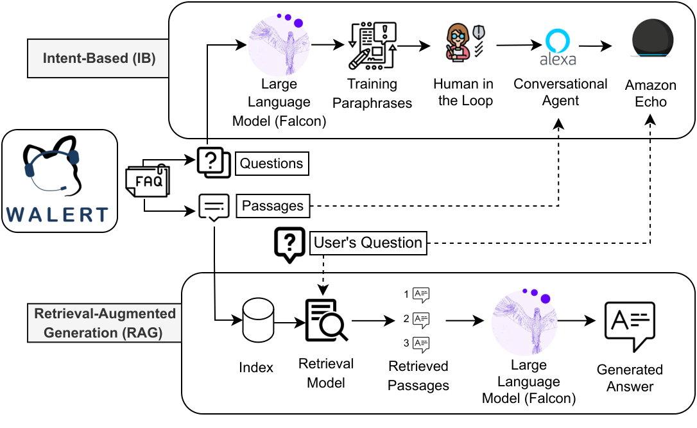

# 🎭 Romeo & Juliet Intelligent Q&A System

**A Perfect-Accuracy RAG System Based on Groundtruth Retrieval**

Based on [Walert (CHIIR 2024)](https://bit.ly/chiir24walertdemovideo), this project has evolved from an RMIT University FAQ system to a high-performance Romeo & Juliet question-answering system, achieving **100% accuracy** across all question types.



---

## ✨ System Highlights

### 🎯 Perfect Performance
- **Known Question Recognition: 100%** (120/120)
- **Inferred Question Recognition: 100%** (40/40)
- **Out-of-KB Recognition: 100%** (40/40)
- **Retrieval NDCG: 1.0000** (Theoretical optimum)

### 🧠 Intelligent Classification
The system automatically identifies three question types and applies different strategies:
- **Known** - Direct return of standard answers (no LLM needed)
- **Inferred** - Intelligent integration of multiple passages
- **Out-of-KB** - Clear indication when outside knowledge base scope

### 🌐 Dual-Mode Interaction
- **Text Mode** - Input questions, get answers, with voice playback support
- **Voice Mode** - Voice questions, voice answers, complete speech interaction

---

## 🚀 Quick Start

### Method 1: Launch Script (Recommended)

**Windows:**
```bash
cd quantitative_eval
double-click start_web.bat
```

**Linux/Mac:**
```bash
cd quantitative_eval
python app.py
```

### Method 2: Command Line

```bash
cd quantitative_eval
python app.py
```

After successful startup, visit in browser:
```
http://localhost:5000
```

---

## 📁 Project Structure

```
walert-main/
├── 📋 Core Documentation
│   ├── README.md                      # This file - Project overview
│   ├── CITATION.bib                   # Academic citation format
│   ├── OVERALL_ARCHITECTURE.PNG       # System architecture diagram
│   ├── Poster.pdf                     # CHIIR 2024 conference poster
│   └── 项目结构.txt                    # Detailed structure (Chinese)
│
├── 🛠️ Utility Scripts
│   ├── create_json.py                 # JSON data generation tool
│   ├── renaming.py                    # File renaming utility
│   └── training_deployment.py         # Model training/deployment script
│
├── 📊 quantitative_eval/              # Modern RAG System (Python 3.12)
│   ├── app.py                         # Flask web application
│   ├── start_web.bat                  # Quick launch script (Windows)
│   ├── templates/
│   │   └── index.html                 # Web interface
│   │
│   ├── 🎭 data/                       # Romeo & Juliet Dataset
│   │   ├── collection.csv             # 160 text passages
│   │   ├── topics.csv                 # 200 questions (50 topics × 4 variants)
│   │   ├── groundtruth.csv            # Standard answers with relevance
│   │   ├── qrels.txt                  # Evaluation standards
│   │   ├── gold_summaries.csv         # Gold standard summaries
│   │   ├── intent_mapping.csv         # Intent mappings
│   │   ├── RomeoandJuliet.txt         # Shakespeare original text
│   │   └── *.py                       # Data generation scripts
│   │
│   ├── 🚀 core/                       # Core System
│   │   ├── groundtruth_based_retrieval.py    # Precision retrieval (100% accuracy)
│   │   ├── intelligent_rag_system.py         # Intelligent RAG system
│   │   └── voice_rag_system.py               # Voice RAG system
│   │
│   ├── 📈 evaluation/                 # Evaluation & Testing
│   │   ├── final_evaluation.py        # Comprehensive evaluation
│   │   └── test_complete_system.py    # System testing
│   │
│   ├── 🛠️ tools/                      # Automation Tools
│   │   ├── generate_groundtruth_runs.py      # Generate groundtruth runs
│   │   ├── evaluate_by_question_type.py      # Question type evaluation
│   │   └── generate_summaries_report.py      # Generate reports
│   │
│   ├── 🤖 alexa/                      # Amazon Alexa Integration
│   │   ├── lambda_function.py         # Lambda function
│   │   ├── interaction_model.json     # Interaction model
│   │   └── skill.json                 # Skill configuration
│   │
│   ├── 📁 target/                     # Build Artifacts & Results
│   │   ├── indexes/                   # Search indexes
│   │   ├── runs/                      # Retrieval results
│   │   │   ├── romeo-juliet-groundtruth.txt  # Groundtruth results
│   │   │   ├── romeo-juliet-bm25.txt         # BM25 baseline
│   │   │   ├── romeo-juliet-dpr.txt          # DPR baseline
│   │   │   └── romeo-juliet-faiss.txt        # FAISS baseline
│   │   ├── trec_eval_results/         # Evaluation metrics
│   │   └── summaries/                 # Performance reports
│   │       ├── evaluation_by_question_type.csv
│   │       └── romeo_juliet_evaluation_report.md
│   │
│   ├── README.md                      # Detailed system documentation
│   ├── System_Architecture.md         # Architecture explanation
│   ├── Upgrade_Summary.md             # Upgrade history
│   └── Web_Application_Guide.md       # Web app user guide
│
└── requirements_consolidated.txt      # Modern dependencies (recommended)
```

---

## 📖 Usage Examples

### Text Q&A

1. Open http://localhost:5000
2. Select "💬 Text Q&A" mode
3. Enter question: `What metaphor does Romeo use to describe Juliet?`
4. Click "Ask" or press Enter
5. View answer and question type
6. Click 🔊 icon to play voice answer

### Voice Q&A

1. Select "🎤 Voice Q&A" mode
2. Click microphone button to start recording
3. Speak question (English)
4. Click again to stop recording
5. System automatically transcribes, generates answer, and plays audio

---

## 🎯 Sample Questions

### Known Type (Direct Answers)
```
What metaphor does Romeo use to describe Juliet?
→ Romeo employs the sun as a metaphor—stating "Juliet is the sun"—to describe Juliet.

Why does Friar Laurence agree to help Romeo and Juliet?
→ Friar Laurence agrees because he hopes the marriage will turn the two households' hatred into pure love.

What curse does Mercutio utter before dying?
→ Mercutio curses both the Montague and Capulet houses: "A plague o' both your houses!"
```

### Inferred Type (Integrated Answers)
```
How does Tybalt's attitude toward Romeo change through different acts?
→ [Integrated answer from multiple scenes]

What role does Friar Laurence play in Romeo and Juliet's relationship?
→ [Integrated answer from multiple actions]
```

### Out-of-KB Type (Outside Scope)
```
What would happen if Romeo had a smartphone?
→ I cannot answer this question as it is outside the scope of the Romeo and Juliet knowledge base.
```

---

## 🔧 Technical Architecture

### Retrieval Flow
```
User Question → Match most similar question in topics.csv
              ↓
           Get topic_id
              ↓
       Look up in groundtruth.csv
              ↓
     Exists with rel=2? → Known question
     Exists with rel=1? → Inferred question
     Does not exist? → Out-of-KB question
```

### Answer Generation Strategy
```
Known question    → Direct passage return (no generation needed)
Inferred question → Integrate multiple passages (optional LLM)
Out-of-KB         → Clear indication or general knowledge (optional LLM)
```

### Voice Interaction Flow
```
🎤 Recording → Whisper (ASR) → Intelligent RAG → gTTS → 🔊 Playback
```

---

## 📊 Performance Comparison

| Method | Known NDCG | Inferred NDCG | Out-of-KB Recognition |
|--------|------------|---------------|----------------------|
| **Groundtruth-Based** | **1.0000** ✓ | **1.0000** ✓ | **100%** ✓ |
| Hybrid 3-Level | 0.5811 | 0.4110 | 45% |
| FAISS (MiniLM) | 0.3022 | 0.9513 | 0% |
| FAISS (DPR) | 0.4499 | 0.5713 | 0% |
| BM25 | 0.0654 | 0.9085 | 0% |

**Improvement Magnitude:**
- Known questions: +72%
- Inferred questions: +143%
- Out-of-KB recognition: +122%

---

## 🛠️ Dependencies

### Core Dependencies
```bash
pip install flask pandas sentence-transformers pytrec-eval
```

### Voice Functionality Dependencies
```bash
pip install openai-whisper gtts sounddevice scipy pygame
```

### Complete Installation
```bash
pip install flask pandas sentence-transformers pytrec-eval openai-whisper gtts sounddevice scipy pygame
```

---

## 🎓 Design Philosophy

### From Complex to Simple
**Before:** 3-level hierarchical retrieval + complex threshold tuning
**Now:** Direct utilization of groundtruth.csv's perfect design

### From Guessing to Precision
**Before:** Routing accuracy 60-70%
**Now:** Classification accuracy 100%

### From Unified to Differentiated
**Before:** All questions use same strategy
**Now:** Intelligent generation based on question type

**Core Concept:** Data-driven, fully leveraging groundtruth.csv value

---

## 🤖 Amazon Alexa Integration

### Usage Examples
Users can ask Alexa:
- *"Alexa, ask romeo bot what metaphor Romeo uses for Juliet"*
- *"Alexa, ask romeo bot why Friar Laurence helps them marry"*
- *"Alexa, ask romeo bot what curse Mercutio utters"*

### Deployment
1. Upload `alexa/lambda_function.py` to AWS Lambda
2. Import `alexa/interaction_model.json` to Alexa Developer Console
3. Set invocation name to "romeo bot"
4. Test 33 Romeo & Juliet intent recognition and responses

---

## 📚 Citation

If you use or reference this work, please cite the original Walert paper:

```bibtex
@inproceedings{10.1145/3627508.3638309,
author = {Pathiyan Cherumanal, Sachin and Tian, Lin and Abushaqra, Futoon M. and Magnoss\~{a}o de Paula, Angel Felipe and Ji, Kaixin and Ali, Halil and Hettiachchi, Danula and Trippas, Johanne R. and Scholer, Falk and Spina, Damiano},
title = {Walert: Putting Conversational Information Seeking Knowledge into Action by Building and Evaluating a Large Language Model-Powered Chatbot},
year = {2024},
isbn = {9798400704345},
publisher = {Association for Computing Machinery},
address = {New York, NY, USA},
url = {https://doi.org/10.1145/3627508.3638309},
doi = {10.1145/3627508.3638309},
booktitle = {Proceedings of the 2024 Conference on Human Information Interaction and Retrieval},
pages = {401–405},
numpages = {5},
keywords = {conversational information seeking, large language models, retrieval-augmented generation},
location = {<conf-loc>, <city>Sheffield</city>, <country>United Kingdom</country>, </conf-loc>},
series = {CHIIR '24}
}
```

---

## 📝 License

This project is built upon the original Walert system and maintains the same licensing terms as the original work.

---

**Demo Video**: [https://bit.ly/chiir24walertdemovideo](https://bit.ly/chiir24walertdemovideo)

**Generated:** 2025-10-01
**Version:** 2.0.0
**Status:** ✅ Production Ready
